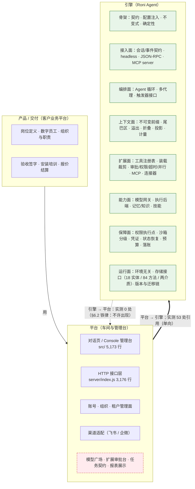
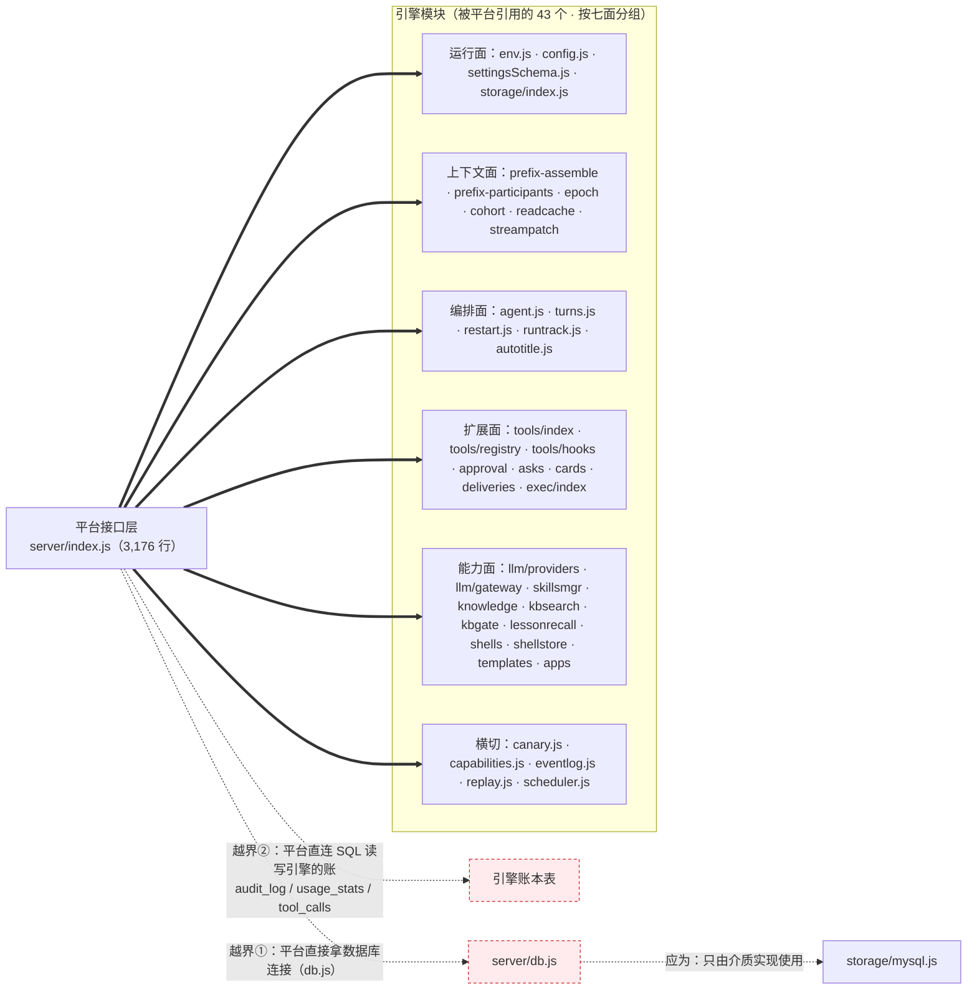

# 架构关系图（v1 · 2026-09-18）

> 只画两张：**①三层总览**（定分层）与 **③引擎↔平台真实依赖**（证明边界现状）。
> 事实来源：`proposals/RW-Agent引擎架构优化方案-v0.3.md` §3（七面+骨架）、§6.2（引擎/平台/产品边界）；
> 依赖数据由源码实测：`server/index.js` 的本地 import 逐条扫、反向依赖全仓扫。

---

## 图 ① 三层总览（谁管什么 · 依赖方向）

**读图要点**

| 层 | 管什么（§6.2 原文要点） | 本仓代码 |
|---|---|---|
| 引擎 | 循环、上下文、模型接入、工具注册表与执行后端、记忆与技能、权限沙箱凭证、状态恢复、账本与审计、装载与版本、接入面与交互契约 | `server/` 下约 19,000 行（不含 index.js 平台层） |
| 平台（车间与管理台） | 造包、发版、样例运行、可选管理与汇总、行业知识与模板资产 | `server/index.js` 3,176 行 + `src/` 5,173 行 ≈ 8,350 行（≈30%） |
| 产品 / 交付 | 岗位定义、组织与职责、验收与签字、安装与培训、报价 | **本仓无代码面**（§0.6：岗位包另有专项） |

**图里唯一的红块**：`S5` 里的"模型广场"属 §6.2 明令"引擎里不该出现"的东西，而现在它住在引擎目录（`server/llm/market.js`，111 行）——这是待搬迁项，不是设计意图。

---

## 图 ③ 引擎 ↔ 平台：真实依赖图（实测）

**实测方法**：① 扫 `server/index.js` 里所有 `from './…'` 的本地 import（53 条）；② 全仓扫"有没有哪个引擎文件 import 平台的 `server/index.js`"（结果 **0 条**；唯二的 `from './index.js'` 是存储实现引用**存储契约** `server/storage/index.js`，不是平台）。

**读图要点**

| 观察 | 事实 | 含义 |
|---|---|---|
| 方向 | 平台 → 引擎 **53 条**；引擎 → 平台 **0 条** | 依赖方向**已经是对的**，没有循环、没有反向抓取 |
| 引擎怎么用平台 | 不用 | 引擎完全不知道平台存在（这正是一条 §6.2 铁律想要的结果） |
| 越界① | 平台 `import { initSchema, db } from './db.js'` | 平台直接拿数据库连接 —— 应改为只用 `storage` 接口 |
| 越界② | 平台自己写 SQL 读引擎的账（32 个直连 SQL 文件里的 `index.js` 部分） | 引擎的事实（审计/用量/工具调用）被平台代码直读，绕过接口 |
| 结论 | 分层**不需要拆乱麻**，只需"把两个部门的工位分开 + 把这两条越界线剪掉" | 风险集中在两处，不在整体 |

---

## 两张图一起说明什么

1. **分层是"归位"不是"重写"**：依赖方向已正确（0 → 反向），要动的是目录、两条越界线、以及 `S5` 那些放错层的平台功能。
2. **"重"的构成**：≈30% 是平台/产品面（定位决定，不砍），≈70% 是引擎面；两者混在同一目录，才产生"引擎很重"的错觉。
3. **下一步可选的两张小范围图**：图 ④-1 一次对话时序（事件契约 / 前缀冻结 / 折叠 / 落账），图 ④-2 存储接口与两介质（18 实体 / 84 方法）。需要时再画。
